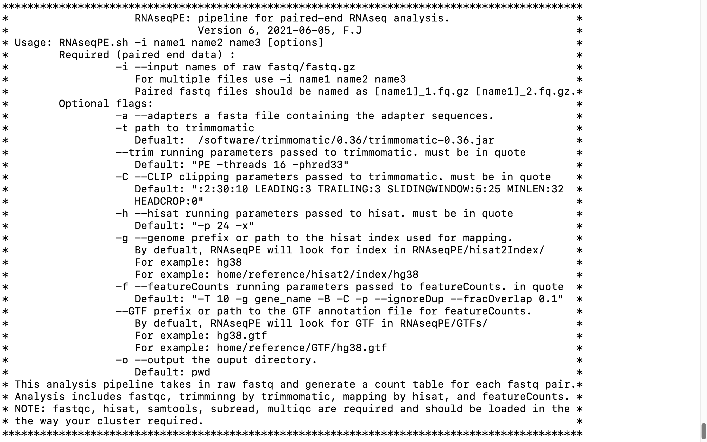

# RNAseqPE
A script for paired end RNA-seq processing

This pipeline was developed to analyze sequencing data in the following publication, please consider citing it:

1. Jiang, F., Hedaya, O.M., Khor, E., Wu, J., Auguste, M., & Yao, P. (2023). [RNA binding protein PRRC2B mediates translation of specific mRNAs and regulates cell cycle progression](https://academic.oup.com/nar/article/51/11/5831/7147500). _Nucleic Acids Research_, 51(11), 5831–5846

## Software prerequisites
This pipeline is designed to run on Linux servers, and requires the following software:

They need to be installed and added to the $PATH before using the pipeline.
```
hisat2
samtools
featureCount (from Subread)
fastqc 
multiqc
```

The above software can be installed using conda, as below:
```
#Create RNAseqPE environment
conda create --name pipernaseq
conda install -n RNAseqPE -c bioconda hisat2
conda install -n RNAseqPE -c bioconda samtools
conda install -n RNAseqPE -c bioconda subread
conda install -n RNAseqPE -c bioconda fastqc
conda install -n RNAseqPE -c bioconda git

#Create another env for multiqc, due to the conflict with pipernaseq:
conda create --name multiqc_env
conda install -n RNAseqPE -c bioconda multiqc
```

## Pipeline setup

1, Download scripts from github to Linux server:

```
git clone https://github.com/fengjiang94/RNAseqPE.git
```

2. add RNAseqPE to $path
```
export PATH=$PATH:/Where RNAseqPE is/RNAseqPE
```

3, Add executable permissions
```
chmod +x /Where RNAseqPE is/RNAseqPE/RNAseqPE.sh
chmod +x /Where RNAseqPE is/RNAseqPE/hisat2Index/hisat2Index.sh
```

4, Set up index files for genome mapping

To use RNAseqPE, hisat2 index is required to map reads to the corresponding genome.

Here is an example to build hisat2 index for hg38 and mm10
```
# build hisat2 index in RNAseqPE/hisat2Index
cd /Where RNAseqPE is/RNAseqPE/hisat2Index/

# hg38
mkdir hg38 # directory to store the index
cd hg38
# download the reference file for hg38 from gencode
wget https://ftp.ebi.ac.uk/pub/databases/gencode/Gencode_human/release_38/gencode.v38.transcripts.fa.gz
gunzip -c gencode.v38.transcripts.fa.gz > gencode.v38.transcripts.fa
# make hisat index
hisat2-build -f gencode.v38.transcripts.fa genome # this requires significant RAM
# remove reference files
rm gencode.v38.transcripts.fa.gz
rm gencode.v38.transcripts.fa
cd ..

# mm10
mkdir mm10 # directory to store the index
cd mm10
# download the reference file for hg38 from gencode
wget https://ftp.ebi.ac.uk/pub/databases/gencode/Gencode_mouse/release_M10/GRCm38.p4.genome.fa.gz
gunzip -c GRCm38.p4.genome.fa.gz > GRCm38.p4.genome.fa
# make hisat index
hisat2-build -f GRCm38.p4.genome.fa genome # this requires significant RAM
# remove reference files
rm GRCm38.p4.genome.fa.gz
rm GRCm38.p4.genome.fa
```

The above script will build hisat2 index in RNAseqPE/hisat2Index/. 

This script is included in RNAseqPE/hisat2Index/hisat2Index.sh for easy reference.

Note that building hisat2 index is RAM and time consuming. please allocate enough resources.

To use the index:
```
RNAseqPE.sh -g hg38
```

5, Download GTF annotation for featureCounts

GTF annotations can be downloaded from UCSC, gencode, ensemble .....
```
# download GFT for hg38 and mm10
cd /Where RNAseqPE is/RNAseqPE/GTFs/
############## download GTF #############
# hg38
wget https://ftp.ebi.ac.uk/pub/databases/gencode/Gencode_human/release_38/gencode.v38.annotation.gtf.gz
gunzip -c gencode.v38.annotation.gtf.gz >gencode.v38.annotation.gtf
rm gencode.v38.annotation.gtf.gz

# mm10
wget https://ftp.ebi.ac.uk/pub/databases/gencode/Gencode_mouse/release_M10/gencode.vM10.annotation.gtf.gz
gunzip -c gencode.vM10.annotation.gtf.gz >gencode.vM10.annotation.gtf
rm gencode.vM10.annotation.gtf.gz
```

To use the index:
```
RNAseqPE.sh --GTF gencode.vM10.annotation.gtf
```

## Usage

For the manual page:

```
RNAseqPE.sh
RNAseqPE.sh --help
```

Manual page:



## Examples

A regular run for raw RNAseq data from human
```
# Raw paired-end RNAseq data hierarchy
RNAseq/
    ├── Data1.RNAseq.R1.fastq.gz
    ├── Data1.RNAseq.R2.fastq.gz
    ├── Data2.RNAseq.R1.fastq.gz
    └── Data2.RNAseq.R2.fastq.gz

# rename the raw sequencing files to get recognized by RNAseqPE
RNAseq/
    ├── Data1.RNAseq_1.fastq.gz
    ├── Data1.RNAseq_2.fastq.gz
    ├── Data2.RNAseq_1.fastq.gz
    └── Data2.RNAseq_2.fastq.gz

# Run RNAseqPE
RNAseqPE.sh -i Data1.RNAseq Data2.RNAseq
            -a /scratch/fjiang7/adapters/novogene.fa
            -t /software/trimmomatic/0.36/trimmomatic-0.36.jar
            --trim "PE -threads 16 -phred33"
            -C ":2:30:10 LEADING:3 TRAILING:3 SLIDINGWINDOW:5:25 MINLEN:32 HEADCROP:0"
            -h "-p 24 -x"
            -g mm10
            --GTF gencode.vM10.annotation.gtf
            -f "-T 10 -g gene_name -B -C -p --ignoreDup --fracOverlap 0.1"
            -o OutputPath
```

After the pipeline finishes, you will get a list of outputs:
```
OutputPath/
    ├── fastqc_beofore/       # fastqc reports for raw sequencing data
        ├── Data1.RNAseq_1.fastq.html
        ├── Data1.RNAseq_1.fastq.zip
        ├── Data1.RNAseq_2.fastq.html
        ├── Data1.RNAseq_2.fastq.zip
        ├── Data2.RNAseq_1.fastq.html
        ├── Data2.RNAseq_1.fastq.zip
        ├── Data2.RNAseq_2.fastq.html
        ├── Data2.RNAseq_2.fastq.zip
     ├── fastqc_beofore/      # fastqc reports for paired data after trimming
        ├── Data1.RNAseq_1.tmp.fastq.html
        ├── Data1.RNAseq_1.tmp.fastq.zip
        ├── Data1.RNAseq_2.tmp.fastq.html
        ├── Data1.RNAseq_2.tmp.fastq.zip
        ├── Data2.RNAseq_1.tmp.fastq.html
        ├── Data2.RNAseq_1.tmp.fastq.zip
        ├── Data2.RNAseq_2.tmp.fastq.html
        ├── Data2.RNAseq_2.tmp.fastq.zip
     ├── trimmed_data/        # trimmed sequencing data
        ├── Data1.RNAseq_1.tmp.fq.gz
        ├── Data1.RNAseq_1.tmu.fq.gz
        ├── Data1.RNAseq_2.tmp.fq.gz
        ├── Data1.RNAseq_2.tmu.fq.gz
        ├── Data2.RNAseq_1.tmp.fq.gz
        ├── Data2.RNAseq_1.tmu.fq.gz
        ├── Data2.RNAseq_2.tmp.fq.gz
        ├── Data2.RNAseq_2.tmu.fq.gz
     ├── mapped_data/        # mapped sequencing data
        ├── Data1.RNAseq.bam
        ├── Data1.RNAseq_mapped.bam
        ├── Data1.RNAseq_mapped.sort.bam
        ├── Data1.RNAseq_mapped.sort.bam.bai
        ├── Data2.RNAseq.bam
        ├── Data2.RNAseq_mapped.bam
        ├── Data2.RNAseq_mapped.sort.bam
        ├── Data2.RNAseq_mapped.sort.bam.bai
        ├── featureCounts.log   
     ├── raw_counts/         # raw featurecounts for sequencing data
        ├── Data1.RNAseq.txt
        ├── Data1.RNAseq.txt.summary
        ├── Data2.RNAseq.txt
        ├── Data2.RNAseq.txt.summary
     ├── multi_fastqc_before_data         
     ├── multi_fastqc_before_data.html  # multiqc report for untrimmed data 
     ├── multi_fastqc_after_data         
     ├── multi_fastqc_after_data.html   # multiqc report for trimmed data 
     ├── trimmomatic.log
     ├── hisat2.log
     ├── sample.csv                     # list of input sequencing data
     ├── hisat2.log
     ├── MappingReport.txt              # A report for mapping quality 
```
Raw gene counts are stored in **raw_count** and can be used for downstream DE analysis with [RNAseqFast](https://github.com/FengJiang94/RNAseqFast)

